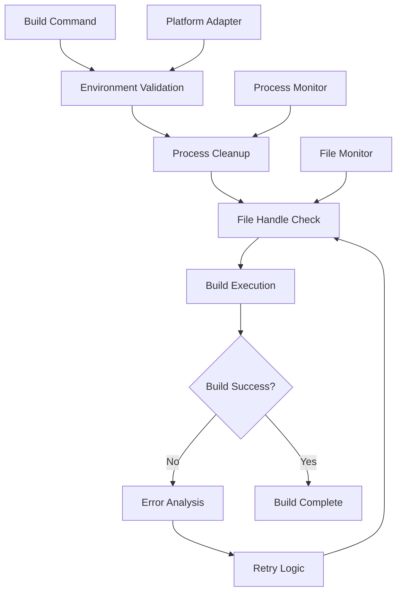

# Design Document

## Overview

The Electron Build Optimization system addresses critical build failures on Windows by implementing intelligent file handle management, process cleanup, and cross-platform build reliability. The design focuses on eliminating the "file being used by another process" error through proactive process management, retry mechanisms, and comprehensive build environment validation.

## Architecture

### Core Components

1. **Build Process Manager**: Orchestrates the entire build workflow with intelligent error handling
2. **File Handle Monitor**: Tracks and manages file access during build operations
3. **Process Cleanup Service**: Ensures clean termination of previous build processes
4. **Environment Validator**: Pre-build system validation and optimization
5. **Cross-Platform Adapter**: Platform-specific optimizations and compatibility layer

### System Flow



## Components and Interfaces

### Build Process Manager

**Purpose**: Central orchestrator for the entire build process with intelligent error handling and retry mechanisms.

**Key Methods**:
- `executeBuild()`: Main build execution with comprehensive error handling
- `validatePreBuild()`: Pre-build environment and dependency validation
- `handleBuildError()`: Intelligent error analysis and recovery
- `generateBuildReport()`: Comprehensive build statistics and diagnostics

**Configuration**:
```typescript
interface BuildConfig {
  maxRetries: number;
  retryDelay: number;
  cleanupTimeout: number;
  enableFileMonitoring: boolean;
  platformOptimizations: boolean;
}
```

### File Handle Monitor

**Purpose**: Real-time monitoring and management of file access during build operations.

**Key Features**:
- Active file handle tracking
- Process-to-file mapping
- Automatic handle cleanup
- Access conflict detection

**Implementation Strategy**:
- Windows: Use `handle.exe` utility and WMI queries
- Cross-platform: Node.js `fs.watch` and process monitoring
- Graceful degradation when system tools unavailable

### Process Cleanup Service

**Purpose**: Ensures clean termination of orphaned build processes and file handles.

**Key Operations**:
- Detect running Electron/build processes
- Force termination of orphaned processes
- Clean temporary build directories
- Validate process cleanup completion

**Platform-Specific Implementations**:
- Windows: `taskkill`, `wmic`, PowerShell commands
- macOS/Linux: `pkill`, `ps`, shell commands

### Environment Validator

**Purpose**: Pre-build validation to prevent common build failures.

**Validation Checks**:
- Disk space availability (minimum 2GB free)
- File system permissions
- Antivirus exclusion recommendations
- Node.js and Electron version compatibility
- Build tool availability

### Cross-Platform Adapter

**Purpose**: Provides platform-specific optimizations and ensures consistent behavior across operating systems.

**Platform Optimizations**:
- Windows: File handle management, process priority adjustment
- macOS: Code signing preparation, notarization setup
- Linux: AppImage/Snap packaging optimizations

## Data Models

### Build Session

```typescript
interface BuildSession {
  id: string;
  startTime: Date;
  endTime?: Date;
  platform: 'win32' | 'darwin' | 'linux';
  status: 'running' | 'success' | 'failed' | 'cancelled';
  errors: BuildError[];
  warnings: BuildWarning[];
  metrics: BuildMetrics;
}
```

### Build Error

```typescript
interface BuildError {
  code: string;
  message: string;
  filePath?: string;
  processId?: number;
  timestamp: Date;
  retryAttempt: number;
  resolution?: string;
}
```

### File Handle Info

```typescript
interface FileHandleInfo {
  filePath: string;
  processId: number;
  processName: string;
  handleType: 'read' | 'write' | 'execute';
  timestamp: Date;
}
```

## Error Handling

### Error Categories

1. **File Access Errors**: "File being used by another process"
   - Detection: Monitor file access patterns
   - Resolution: Process cleanup + retry with backoff
   - Prevention: Pre-build process validation

2. **Resource Exhaustion**: Insufficient disk space or memory
   - Detection: System resource monitoring
   - Resolution: Cleanup temporary files, optimize build settings
   - Prevention: Pre-build resource validation

3. **Permission Errors**: Insufficient file system permissions
   - Detection: File operation failure analysis
   - Resolution: Elevated permission requests, path adjustments
   - Prevention: Permission validation during setup

4. **Process Conflicts**: Multiple build processes running
   - Detection: Process enumeration and analysis
   - Resolution: Graceful termination of conflicting processes
   - Prevention: Build lock file mechanism

### Retry Strategy

```typescript
interface RetryConfig {
  maxAttempts: 3;
  baseDelay: 2000; // 2 seconds
  maxDelay: 30000; // 30 seconds
  backoffMultiplier: 2;
  retryableErrors: ['EBUSY', 'EACCES', 'EPERM'];
}
```

## Testing Strategy

### Unit Tests

1. **Build Process Manager Tests**
   - Build execution flow validation
   - Error handling and retry logic
   - Configuration management

2. **File Handle Monitor Tests**
   - File access tracking accuracy
   - Process-to-file mapping validation
   - Cleanup operation effectiveness

3. **Process Cleanup Service Tests**
   - Orphaned process detection
   - Safe process termination
   - Directory cleanup validation

### Integration Tests

1. **End-to-End Build Tests**
   - Complete build process execution
   - Error simulation and recovery
   - Cross-platform compatibility

2. **Concurrent Build Tests**
   - Multiple build process handling
   - Resource conflict resolution
   - Build queue management

3. **System Resource Tests**
   - Low disk space scenarios
   - High memory usage conditions
   - Antivirus interference simulation

### Performance Tests

1. **Build Time Optimization**
   - Baseline build time measurement
   - Optimization impact assessment
   - Resource usage profiling

2. **Error Recovery Performance**
   - Retry mechanism efficiency
   - Error detection speed
   - Recovery time measurement

## Security Considerations

### File System Security

- Validate all file paths to prevent directory traversal
- Implement secure temporary file creation
- Ensure proper cleanup of sensitive build artifacts

### Process Security

- Validate process termination permissions
- Implement safe process enumeration
- Prevent privilege escalation during cleanup

### Build Artifact Security

- Secure handling of code signing certificates
- Protected storage of build configurations
- Audit trail for build modifications

## Performance Optimizations

### Build Speed Improvements

1. **Parallel Processing**: Utilize multiple CPU cores for build operations
2. **Incremental Builds**: Skip unchanged components when possible
3. **Caching Strategy**: Cache frequently used build artifacts
4. **Resource Pooling**: Reuse build resources across multiple builds

### Memory Management

1. **Streaming Operations**: Process large files in chunks
2. **Garbage Collection**: Explicit cleanup of build objects
3. **Memory Monitoring**: Track and limit memory usage during builds
4. **Resource Limits**: Implement configurable resource constraints

### Disk I/O Optimization

1. **Batch Operations**: Group file operations for efficiency
2. **Compression**: Compress temporary build artifacts
3. **SSD Optimization**: Leverage SSD-specific optimizations when available
4. **Network Storage**: Handle network-mounted build directories efficiently